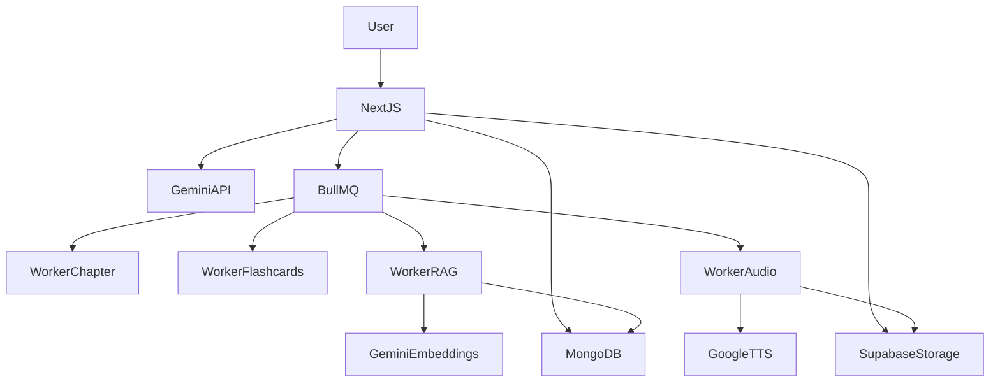

# LearnSphere

An AI-powered course creation and study platform built with Next.js, MongoDB, Google Gemini AI, and Supabase Storage.

## Features

- **AI-Powered Course Generation** — Upload PDFs and automatically generate structured course content using Google Gemini
- **Interactive Study Materials**
  - **Notes & Chapters** — Organized course content with chapter navigation
  - **Flashcards** — Interactive study cards with flip animations
  - **Quizzes** — AI-generated multiple choice questions with scoring
  - **Q&A** — Descriptive questions and detailed answers
- **AI Study Assistant** — Persistent floating chat panel powered by Gemini with RAG-aware context
- **PDF Upload & RAG Pipeline** — Upload documents for AI-powered search and contextual answers
- **Background Job Processing** — BullMQ workers for parallel AI content generation
- **Audio Overviews** — AI-generated audio summaries using Google Cloud TTS
- **User Dashboard** — Track and manage courses
- **Authentication** — Clerk-powered auth with protected routes

## Tech Stack

| Technology                     | Purpose                              |
| ------------------------------ | ------------------------------------ |
| Next.js 15 (App Router)        | Full-stack React framework           |
| TypeScript                     | Type-safe codebase                   |
| MongoDB (Mongoose)             | Primary database                     |
| Supabase Storage               | File storage (PDFs, audio)           |
| Google Gemini AI               | All AI tasks (text gen + embeddings) |
| Vercel AI SDK + @ai-sdk/google | Streaming chat                       |
| BullMQ + Redis                 | Background job queue                 |
| Clerk                          | Authentication                       |
| Tailwind CSS                   | Styling                              |
| Zod                            | Input validation                     |
| pino                           | Structured logging                   |

## Environment Variables

| Variable                            | Description                                         | Required |
| ----------------------------------- | --------------------------------------------------- | -------- |
| `MONGODB_URI`                       | MongoDB Atlas connection string                     | ✅       |
| `NEXT_PUBLIC_SUPABASE_URL`          | Supabase project URL                                | ✅       |
| `SUPABASE_SERVICE_ROLE_KEY`         | Supabase service role key (for server-side storage) | ✅       |
| `GOOGLE_GENERATIVE_AI_API_KEY`      | Google Gemini API key for all AI tasks              | ✅       |
| `GOOGLE_CLOUD_TTS_KEY`              | Google Cloud Text-to-Speech API key                 | Optional |
| `REDIS_URL`                         | Redis connection URL for BullMQ                     | Optional |
| `NEXT_PUBLIC_CLERK_PUBLISHABLE_KEY` | Clerk publishable key                               | ✅       |
| `CLERK_SECRET_KEY`                  | Clerk secret key                                    | ✅       |
| `NEXTAUTH_SECRET`                   | NextAuth secret                                     | Optional |
| `NEXTAUTH_URL`                      | NextAuth URL                                        | Optional |

## MongoDB Atlas Vector Search Setup

To enable RAG (Retrieval-Augmented Generation) for the AI assistant:

1. Navigate to your MongoDB Atlas cluster
2. Go to **Atlas Search** → **Create Index**
3. Select **JSON Editor** and use the following index definition:

```json
{
  "fields": [
    {
      "type": "vector",
      "path": "embedding",
      "numDimensions": 768,
      "similarity": "cosine"
    },
    {
      "type": "filter",
      "path": "resourceId"
    }
  ]
}
```

4. **Index name**: `vector_index`
5. **Collection**: `documentChunks`
6. **Dimensions**: 768 (from Gemini `text-embedding-004`)
7. **Similarity**: cosine

## Supabase Storage Setup

Create the following storage buckets in your Supabase project:

1. **`pdfs`** — For uploaded PDF course materials
2. **`documents`** — For PDFs uploaded for RAG processing
3. **`audio-overviews`** — For generated audio overview MP3 files

Set appropriate bucket policies (public read for serving content).

## Local Development

### Prerequisites

- Node.js 18+
- MongoDB Atlas account (or local MongoDB)
- Supabase project
- Google Cloud account with Gemini API enabled
- Redis (optional, for background jobs)

### Setup

```bash
# Install dependencies
npm install

# Copy environment variables
cp .env.example .env
# Fill in your environment variables in .env

# Run development server
npm run dev

# Open http://localhost:3000
```

### Available Scripts

| Script                 | Description                     |
| ---------------------- | ------------------------------- |
| `npm run dev`          | Start dev server with Turbopack |
| `npm run build`        | Production build                |
| `npm start`            | Start production server         |
| `npm run lint`         | Run ESLint                      |
| `npm run format`       | Format code with Prettier       |
| `npm run format:check` | Check formatting                |

## Architecture



## Project Structure

```
├── app/
│   ├── api/
│   │   ├── chat/route.ts              # AI chat with RAG
│   │   ├── generate/route.ts          # Trigger AI generation jobs
│   │   ├── generate/status/route.ts   # Check job status
│   │   ├── upload/route.ts            # PDF upload for RAG
│   │   ├── courses/route.ts           # List user courses
│   │   ├── courses/[id]/route.ts      # Get single course
│   │   ├── generate-course-ouline/    # Course generation
│   │   ├── notes/[courseId]/route.ts   # Generate notes
│   │   ├── quiz/[id]/route.ts         # Generate quiz
│   │   ├── flash/[id]/route.ts        # Generate flashcards
│   │   └── qna/[id]/route.ts          # Generate Q&A
│   ├── course/                        # Course pages
│   ├── dashboard/                     # User dashboard
│   └── components/                    # UI components
├── components/
│   ├── ai-assistant/ChatPanel.tsx     # AI chat sidebar
│   └── upload/PDFUploader.tsx         # PDF drag-drop upload
├── lib/
│   ├── db/mongodb.ts                  # Mongoose singleton connection
│   ├── env.ts                         # Zod env validation
│   ├── logger.ts                      # pino logger
│   ├── ai/
│   │   ├── gemini.ts                  # Gemini client singleton
│   │   ├── embeddings.ts             # Gemini embedding helpers
│   │   └── rag.ts                     # RAG retrieval logic
│   ├── queue/
│   │   ├── index.ts                   # BullMQ queue definitions
│   │   └── workers/                   # Background workers
│   └── supabase/storage.ts           # Supabase Storage client
├── models/                            # Mongoose models
├── types/                             # TypeScript types & Zod schemas
├── configs/AiModel.ts                # Gemini AI model configs
└── .env.example
```

## API Response Format

All API routes use a consistent response shape:

```typescript
// Success
{ success: true, data: T }

// Error
{ success: false, error: string }
```
